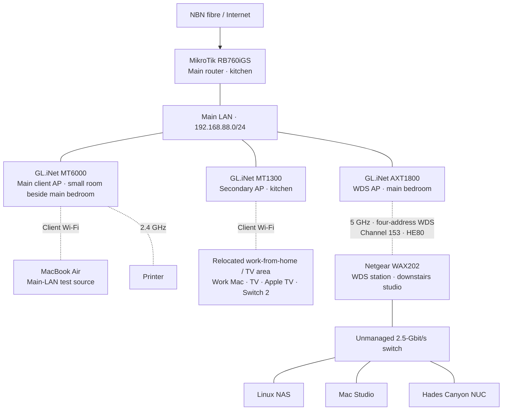

# Network topology

Recorded on 2026-10-06 from the WDS investigation inventory and packet captures.
The whole-network diagram describes logical links and physical locations.
Fresh private configuration exports were collected from all five network devices.
Exact switch ports and reviewed reproducible templates remain pending.

## Whole network

Solid lines are Ethernet links. Dashed lines are wireless links. The Air is shown
in its investigation role; its connection and location can change outside a test.
The studio wall Ethernet port is limited to 100 Mbit/s and is not the uplink.

## Critical forwarding path

The capture on 2026-10-06 verified AXT1800 `wan` as the main-LAN bridge port.
Runtime interface names can change after an upgrade or reassociation.
Discover the actual interfaces before each diagnostic capture.

## Device inventory

| Device | Role | Management / host IPv4 | Software evidence |
|---|---|---|---|
| MikroTik RB760iGS | Main router and gateway | `192.168.88.1` | RouterOS 7.23.2 stable, captured 2026-10-06 |
| GL.iNet MT6000 | Main client access point | `192.168.88.2` | Vendor build; OpenWrt 21.02-SNAPSHOT base, kernel 5.4.238 |
| GL.iNet MT1300 | Kitchen and relocated work-from-home / TV access point | `192.168.88.3` | Vendor build; OpenWrt 22.03.4 base, kernel 5.10.176 |
| GL.iNet AXT1800 | WDS access point | `192.168.88.115` | OpenWrt 25.12.5, kernel 6.12.94, captured 2026-10-06 |
| Netgear WAX202 | WDS station | `192.168.88.4` | OpenWrt 25.12.2, kernel 6.12.74, captured 2026-10-06 |
| Linux NAS | Studio server | `192.168.88.6` | Host configuration under `host/` |
| Mac Studio | Studio workstation | `192.168.88.121` | Client configuration outside network-device scope |
| Hades Canyon NUC | Studio computer | `192.168.88.139` | Client configuration outside network-device scope |

DHCP means Dynamic Host Configuration Protocol. Record the router DHCP pool,
reservations, and static-address policy during the configuration export.
Do not infer them from an Address Resolution Protocol (ARP) table.

The user confirmed the MT1300 client coverage and current AP locations on
2026-10-06. The relocated work and TV area has poor reception from the MT6000.
Confirm exact wired versus wireless client connections during the inventory.
The Air SSH aliases are `mt6000`, `mt1300`, `wax202`, `axt1800`, and `mikrotik`.

The same aliases are available in the Linux container. Live IPv4 state confirms
the four OpenWrt management addresses on `br-lan`. Some vendor UCI settings
describe another LAN mode; use runtime addresses when documenting the current
access-point mode. The vendor firmware release identifiers still need recording.
